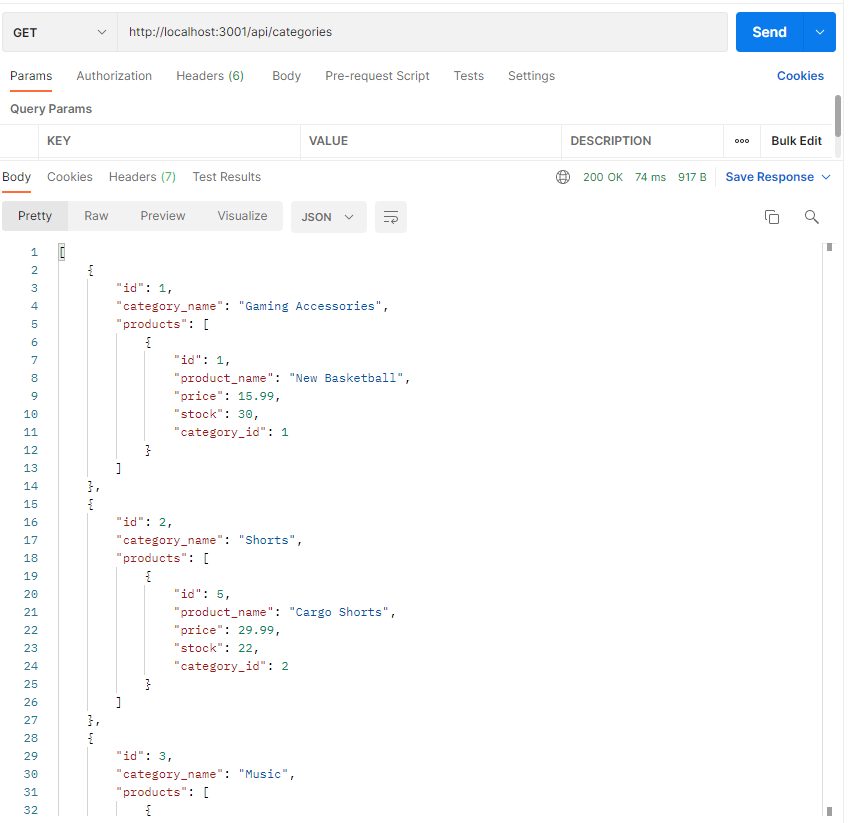

  # E-Commerce (Back-End)

  ## **Video Demonstration**

  - https://watch.screencastify.com/v/yJuXHTVmQGrRhPddqkYU

  ## **Description**
   
  - E-Commerce (Back-End) allows management of online retail companies to use the latest tech to compete with other e-commerce companies. Users can manage (Create, Read, Update, and Delete) product inventory, categories, and tags; while maintaining records of stock, prices, and product-tags. 
  - This application was written using JavaScript, Node, Express.js, SQL
  - E-Commerce provides the foundational database and server structure to facilitate online inventory management. 
  - As a developer, this application helped to practice and grow my understanding of Sequilize ORM to maintain a mysql database in full Javascript. 

  ## **Table of Contents** 
  
  - [installation](#installation)
  - [Usage](#usage)
  - [Credits](#credits)
  - [License](#license)

  ## **Installation**
  
  To install the application, please follow the link to my GitHub repo and clone the code into your local machine. Open the code in your preferred code editor and install dependencies in the terminal by entering `npm i` and  access the MYSQL CLI using `mysql -u [YOUR USERNAME] -p`, then enter `SOURCE db/schema.sql` and after use the database`USE ecommerce_db;`. Close the MYSQL CLI `quit` or open another terminal and seed the premade data to test functionality `npm run seed` then start the server with `node server.js` or `nodemon server`. From here you can test the API routes in your preferred API platform i.e. Postman or Insomnia. 

  ## **Usage**

  To access category routes use `/api/categories/', for products use `/api/products/`, and for tags use `/api/tags/`. Users can CREATE, READ, UPDATE, and DELETE using these api routes.

  ## **Credits** 

  This project was built by Michael Cortez-Mejia 

  
  ## **License**

  

  To see more info regarding this license, please visit https://choosealicense.com/licenses/mit/
  

  ## **How to Contribute**

  If you would like to add/contribute to the project, feel free to fork from GitHub @MCORTEZM1 
  Or click here: https://github.com/MCORTEZM1/E-commerce

  ## **Questions / Contact Me**

  Please reach out with any questions or concerns directly to: MCortezM@yahoo.com

## **Tests**

  Simply enter the routes into your API platform and perform GET, POST, PUT, and DELETE requests. Be sure to enter the necessary req.body data for CREATE and UPDATE requests. 
  

